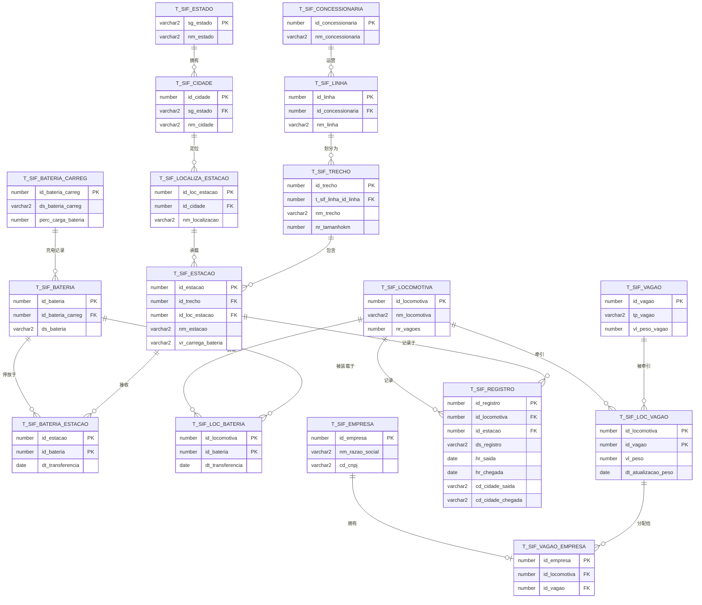

# 🏆 FeVias — Winner of the Stellantis Challenge (FIAP)

> **FeVias (FerroVias)** won the **Stellantis smart-mobility challenge** run at **FIAP**.
> It is an Oracle database that models a **battery-swap station network for a
> railway mesh**: locomotives run on rechargeable batteries and swap them at
> stations spread along the Brazilian rail grid, instead of burning diesel.

[](https://www.fiap.com.br/)
[](https://opensource.org/licenses/MIT)
[](https://www.oracle.com/database/free/)

**🌐 Language / Idioma / Langue / 语言:**
[🇬🇧 English](#english) · [🇧🇷 Português](#portugues) · [🇫🇷 Français](#francais) · [🇨🇳 简体中文](#chinese)

> The analytical **[Findings](#findings)** section is kept in English only; the
> Portuguese, French and Chinese sections link to it.

---

<a id="english"></a>
<details open>
<summary><b>🇬🇧 English</b></summary>

### Overview

The Stellantis group challenged FIAP students: **"How can technology and
innovation contribute to mobility — increasing efficiency, reducing accidents,
widening access for populations, and fostering a real smart society and smart
mobility?"**

**FeVias** answers with a database for a railway that runs on **clean energy and
rechargeable batteries**. Locomotives no longer depend on a fuel supply chain:
they carry battery packs and **swap them for charged ones at stations** along
each route. The schema captures the whole picture — the rail network
(concessionaires → lines → segments → stations), the rolling stock (locomotives,
wagons, batteries), and the operational events that tie them together
(trips, battery transfers, wagon assignments).

### Solution video

Click the image to watch the project walkthrough:

[](https://www.youtube.com/watch?v=n5WVaHOHnvI)

### Data model (ERD)

The diagram below is generated directly from `DDL_FeVias.sql` — 17 tables, with
primary keys, foreign keys and cardinalities exactly as the constraints declare
them. `||--o{` reads "one to zero-or-many"; `||--o|` reads "one to zero-or-one".


### Project Development in Oracle SQL

The original diagram from when the database was first built in Oracle SQL — kept
here as the authentic record of the project's original design work, predating the
current AI era:


### Data dictionary

| Table | Purpose | Key columns |
|---|---|---|
| `t_sif_estado` | Brazilian states (lookup) | `sg_estado` **PK** |
| `t_sif_cidade` | Cities, each in a state | `id_cidade` **PK**, `sg_estado` FK |
| `t_sif_localiza_estacao` | Physical station location / address | `id_loc_estacao` **PK**, `id_cidade` FK |
| `t_sif_estacao` | Stations; `vr_carrega_bateria` = can it charge (`S`/`N`) | `id_estacao` **PK**, `id_trecho` FK, `id_loc_estacao` FK |
| `t_sif_concessionaria` | Rail concessionaires | `id_concessionaria` **PK** |
| `t_sif_linha` | Lines operated by a concessionaire | `id_linha` **PK**, `id_concessionaria` FK |
| `t_sif_trecho` | Route segments of a line, with length in km | `id_trecho` **PK**, `t_sif_linha_id_linha` FK |
| `t_sif_locomotiva` | Locomotives; `nr_vagoes` = wagon count | `id_locomotiva` **PK** |
| `t_sif_vagao` | Wagons; type `P`/`O`, weight | `id_vagao` **PK** |
| `t_sif_loc_vagao` | Which wagons a locomotive pulls (+ weight, timestamp) | `(id_locomotiva, id_vagao)` **PK** |
| `t_sif_empresa` | Operating companies (CNPJ) | `id_empresa` **PK** |
| `t_sif_vagao_empresa` | Company ↔ (locomotive, wagon) ownership | `id_empresa` **PK** + FK to `loc_vagao` |
| `t_sif_bateria_carreg` | Battery charge record; `perc_carga_bateria` % | `id_bateria_carreg` **PK** |
| `t_sif_bateria` | Batteries | `id_bateria` **PK**, `id_bateria_carreg` FK |
| `t_sif_bateria_estacao` | Battery ↔ station transfers (+ timestamp) | `(id_estacao, id_bateria)` **PK** |
| `t_sif_loc_bateria` | Battery ↔ locomotive mounts (+ timestamp) | `(id_locomotiva, id_bateria)` **PK** |
| `t_sif_registro` | Trip log: departure/arrival times and cities | `id_registro` **PK**, `id_locomotiva` FK, `id_estacao` FK |

<a id="findings"></a>
### Findings

Five analytical queries live in [`queries/`](queries), one per file, each with a
header comment stating the operational question it answers. The numbers below are
computed from the **deterministic seed** in `DML_FeVias.sql` (fixed literal
values, no randomness) and were **verified statically** — every table and column
referenced exists in the DDL. Reproduce them live against Oracle with
`make seed && make query` (see [Running it](#running-it)).

> **Data honesty up front:** the seed populates only **12 of the 17 tables**. The
> five operational/event tables — `registro`, `bateria_estacao`, `loc_bateria`,
> `loc_vagao`, `vagao_empresa` — are **empty**. Where a question needs them, the
> finding says so rather than inventing a conclusion.

#### 1. Battery fleet readiness — [`queries/01_battery_fleet_readiness.sql`](queries/01_battery_fleet_readiness.sql)

Which packs are below the 50% charge needed to be swap-ready?

| id_bateria | ds_bateria | perc_carga_bateria | swap_status |
|--:|---|--:|---|
| 2 | Bateria 2 | 37 | BELOW THRESHOLD |
| 3 | Bateria 3 | 44 | BELOW THRESHOLD |
| 6 | Bateria 6 | 47 | BELOW THRESHOLD |
| 7 | Bateria 7 | 52 | READY |
| 1 | Bateria 1 | 75 | READY |
| 4 | Bateria 4 | 75 | READY |
| 5 | Bateria 5 | 92 | READY |

**Reading:** 3 of 7 packs (**43%**) sit below the 50% swap-ready line; the fleet
mean is **60%**. It's a plausible readiness snapshot — but the charge values are
static literals with no timestamp, so this is one moment, not a trend the data
can support.

#### 2. Charging gaps by segment — [`queries/02_charging_gaps_by_trecho.sql`](queries/02_charging_gaps_by_trecho.sql)

Is there any route segment with **no** charging station on it?

| id_trecho | nm_trecho | nr_tamanhokm | qt_estacoes | qt_estacoes_carregadoras |
|--:|---|--:|--:|--:|
| 5 | Itaqui a Mucuripe | 1000 | 0 | 0 |
| 4 | Carajás a São Luís | 892 | 3 | 3 |
| 2 | Itaqui a Mucuripe | 1000 | 4 | 4 |
| 3 | Rondonópolis a Santa Fé do Sul | 696 | 4 | 4 |
| 1 | Itaqui a Pecém | 1000 | 5 | 5 |

**Reading:** one **1000 km** segment (trecho 5) has **zero** stations — a real
coverage hole for a battery-only fleet. Every station that *does* exist is flagged
chargeable (`S`); there is not a single `N` in the data, so the
charging-vs-non-charging distinction can't actually be exercised on this seed.

#### 3. Swap interval vs. range — [`queries/03_swap_interval_by_trecho.sql`](queries/03_swap_interval_by_trecho.sql)

On each segment, how far between charging stations, and does it exceed a nominal
300 km battery range?

| id_trecho | nm_trecho | nr_tamanhokm | qt_estacoes_carregadoras | km_por_estacao | avaliacao_autonomia |
|--:|---|--:|--:|--:|---|
| 5 | Itaqui a Mucuripe | 1000 | 0 | — | NO COVERAGE |
| 4 | Carajás a São Luís | 892 | 3 | 297.3 | OK |
| 2 | Itaqui a Mucuripe | 1000 | 4 | 250.0 | OK |
| 1 | Itaqui a Pecém | 1000 | 5 | 200.0 | OK |
| 3 | Rondonópolis a Santa Fé do Sul | 696 | 4 | 174.0 | OK |

**Reading:** among covered segments, spacing runs **174–297 km/station**, all
under the 300 km nominal range — no range risk flagged, though trecho 4 is close.
Caveat: km-per-station assumes even spacing; the schema stores no station ordering
or coordinates, so a real gap between two consecutive stations could exceed the
average and this proxy would miss it.

#### 4. Wagon payload pool — [`queries/04_wagon_payload_pool.sql`](queries/04_wagon_payload_pool.sql)

How much payload can the wagon pool haul, split by passenger vs. freight?

| tp_vagao | tipo | qt_vagoes | peso_total | peso_medio | peso_min | peso_max |
|---|---|--:|--:|--:|--:|--:|
| O | Carga/Objetos | 12 | 4750 | 395.8 | 100 | 700 |

**Reading:** the pool is **100% freight** — zero passenger wagons — despite the
Stellantis brief's emphasis on population access; that's a data gap, not a design
statement. Declared capacity is **4,750 t across 12 wagons**. Per-locomotive
payload can't be computed because `t_sif_loc_vagao` (the wagon-to-locomotive
assignment) is empty.

#### 5. Operational telemetry coverage — [`queries/05_operational_telemetry_coverage.sql`](queries/05_operational_telemetry_coverage.sql)

What operational history do we actually have?

| fonte | qt |
|---|--:|
| Trip records (t_sif_registro) | 0 |
| Battery→station transfers (t_sif_bateria_estacao) | 0 |
| Battery→locomotive mounts (t_sif_loc_bateria) | 0 |
| Locomotive-wagon links (t_sif_loc_vagao) | 0 |
| Wagon-company links (t_sif_vagao_empresa) | 0 |

**Reading:** the entire event layer is **empty**. Trips, swaps at stations,
battery mounts and wagon assignments were never seeded, so every throughput,
dwell-time and utilization KPI is currently **unanswerable**. This is the
dataset's single biggest limitation and the first thing real instrumentation
would fill.

### Design decisions

**Why this normalization.** Geography is a clean 3NF lookup chain —
`estado → cidade → localiza_estacao → estacao` — and the network hierarchy mirrors
it: `concessionaria → linha → trecho → estacao`. Battery *identity*
(`t_sif_bateria`) is separated from *charge state* (`t_sif_bateria_carreg`) so a
pack's reading can change without rewriting its identity row. Many-to-many
operational relationships are resolved through junction tables
(`bateria_estacao`, `loc_bateria`, `loc_vagao`, `vagao_empresa`), each carrying
its own event attributes (`dt_transferencia`, `vl_peso`, …).

**What was denormalized on purpose.**
- `t_sif_registro.cd_cidade_saida` / `cd_cidade_chegada` keep origin/destination
  city as plain text next to the `id_estacao` FK. A trip log is write-heavy and
  read on the hot path; storing the city inline avoids the
  `estacao → localiza_estacao → cidade` join on every read. Trade-off: it can
  drift from the `cidade` table.
- `t_sif_localiza_estacao.nm_localizacao` is free-text that restates city/state
  already reachable via `id_cidade` — kept for human-readable station addressing.
- `t_sif_locomotiva.nr_vagoes` is a stored wagon count also derivable from
  `t_sif_loc_vagao` — a maintained aggregate for quick display.

**As-built quirks worth flagging** (not changed — schema and data are out of scope):
- `t_sif_vagao_empresa`'s primary key is `id_empresa` **alone**, so a company can
  appear only once and cannot own more than one `(locomotive, wagon)` pair. With
  real data this should be a composite key `(id_empresa, id_locomotiva, id_vagao)`.
- `t_sif_bateria` ↔ `t_sif_bateria_carreg` is effectively **1:1**; the separate
  table only earns its keep once charge cycles are historized over time.
- Data-quality notes in the DML: concessionaire "Rumo S/A" is inserted twice; the
  "Malha Paulista" line takes its `id_concessionaria` from the *line* sequence (a
  `currval` slip); and every station is flagged chargeable. Left as-is because the
  data is out of scope — flagged so a reader doesn't trust them blindly.

**What I'd change with real data.** Historize charge readings with timestamps
(turn the readiness snapshot into a trend); add coordinates or an ordinal position
to stations so inter-swap distance is exact instead of an average; promote
`vagao_empresa` to a composite key; and above all **populate the event tables**
(`registro`, `bateria_estacao`, `loc_bateria`, `loc_vagao`) — they are the
schema's whole operational value and are empty today.

<a id="running-it"></a>
### Running it

No account or license is needed — the setup uses Oracle Database Free in a
container. Requirements: Docker (with Compose) and `make`.

```bash
make seed     # start Oracle, load DDL_FeVias.sql then DML_FeVias.sql
make query    # run every file in queries/ and print the results
make psql     # open an interactive SQL*Plus session
make down     # stop the container (keeps data)
make clean    # stop and delete the volume
```

The DML file is ISO-8859-1 (Latin-1); the Makefile sets `NLS_LANG` so the client
reads it in the right charset. **The SQL files are mounted read-only — the
container never modifies the schema or the data.**

Prefer a database you already have? Run `DDL_FeVias.sql`, then `DML_FeVias.sql`,
then any file in `queries/` in an Oracle SQL client.

### Project files

- **`DDL_FeVias.sql`** — schema: tables, constraints, comments, sequences.
- **`DDL_Drop.sql`** — drops the whole schema for a clean rebuild.
- **`DML_FeVias.sql`** — seed data (real Brazilian lines + fictional swap network).
- **`queries/`** — five analytical queries, one operational question each.
- **`docker-compose.yml`, `Makefile`** — minimal, reproducible run environment.

### License & contact

MIT — see [LICENSE](LICENSE). Questions:
[anacarolina.cartola@gmail.com](mailto:anacarolina.cartola@gmail.com).

</details>

---

<a id="portugues"></a>
<details>
<summary><b>🇧🇷 Português</b></summary>

### Visão geral

O grupo Stellantis desafiou os alunos da FIAP: **"Como a tecnologia e a inovação
podem contribuir para a mobilidade — aumentando a eficiência, reduzindo
acidentes, ampliando o acesso das populações e criando uma verdadeira smart
society e smart mobility?"**

**FeVias** responde com um banco de dados para uma ferrovia movida a **energia
limpa e baterias recarregáveis**. As locomotivas deixam de depender de uma cadeia
de combustível: carregam pacotes de bateria e **os trocam por outros carregados
nas estações** ao longo de cada rota. O schema captura o quadro completo — a malha
ferroviária (concessionárias → linhas → trechos → estações), o material rodante
(locomotivas, vagões, baterias) e os eventos operacionais que os conectam
(viagens, transferências de bateria, alocação de vagões).

### Vídeo da solução

Clique na imagem para assistir à apresentação do projeto:

[](https://www.youtube.com/watch?v=n5WVaHOHnvI)

### Modelo de dados (DER)

O diagrama abaixo é gerado diretamente de `DDL_FeVias.sql` — 17 tabelas, com
chaves primárias, estrangeiras e cardinalidades exatamente como as constraints
declaram. `||--o{` lê-se "um para zero-ou-muitos"; `||--o|` lê-se "um para
zero-ou-um".


### Desenvolvimento do projeto em Oracle SQL

O diagrama original de quando o banco foi construído em Oracle SQL — mantido aqui
como registro autêntico do trabalho de modelagem original do projeto, anterior à
era atual da IA:


### Dicionário de dados

| Tabela | Finalidade | Colunas-chave |
|---|---|---|
| `t_sif_estado` | Estados brasileiros (lookup) | `sg_estado` **PK** |
| `t_sif_cidade` | Cidades, cada uma em um estado | `id_cidade` **PK**, `sg_estado` FK |
| `t_sif_localiza_estacao` | Localização/endereço físico da estação | `id_loc_estacao` **PK**, `id_cidade` FK |
| `t_sif_estacao` | Estações; `vr_carrega_bateria` = carrega? (`S`/`N`) | `id_estacao` **PK**, `id_trecho` FK, `id_loc_estacao` FK |
| `t_sif_concessionaria` | Concessionárias ferroviárias | `id_concessionaria` **PK** |
| `t_sif_linha` | Linhas operadas por uma concessionária | `id_linha` **PK**, `id_concessionaria` FK |
| `t_sif_trecho` | Trechos de uma linha, com extensão em km | `id_trecho` **PK**, `t_sif_linha_id_linha` FK |
| `t_sif_locomotiva` | Locomotivas; `nr_vagoes` = qtd. de vagões | `id_locomotiva` **PK** |
| `t_sif_vagao` | Vagões; tipo `P`/`O`, peso | `id_vagao` **PK** |
| `t_sif_loc_vagao` | Quais vagões uma locomotiva puxa (+ peso, data) | `(id_locomotiva, id_vagao)` **PK** |
| `t_sif_empresa` | Empresas operadoras (CNPJ) | `id_empresa` **PK** |
| `t_sif_vagao_empresa` | Empresa ↔ (locomotiva, vagão) | `id_empresa` **PK** + FK para `loc_vagao` |
| `t_sif_bateria_carreg` | Registro de carga; `perc_carga_bateria` % | `id_bateria_carreg` **PK** |
| `t_sif_bateria` | Baterias | `id_bateria` **PK**, `id_bateria_carreg` FK |
| `t_sif_bateria_estacao` | Transferências bateria ↔ estação (+ data) | `(id_estacao, id_bateria)` **PK** |
| `t_sif_loc_bateria` | Montagens bateria ↔ locomotiva (+ data) | `(id_locomotiva, id_bateria)` **PK** |
| `t_sif_registro` | Registro de viagens: horários e cidades | `id_registro` **PK**, `id_locomotiva` FK, `id_estacao` FK |

### Resultados analíticos

📊 A seção de resultados (**Findings**) é mantida apenas em inglês. **[Ver os
resultados analíticos →](#findings)**

Em resumo: são cinco consultas em [`queries/`](queries), uma pergunta operacional
cada. Um alerta importante que vale em qualquer idioma — o seed popula apenas
**12 das 17 tabelas**; as cinco tabelas de eventos (`registro`, `bateria_estacao`,
`loc_bateria`, `loc_vagao`, `vagao_empresa`) estão **vazias**, então toda métrica
de throughput e utilização fica sem resposta até haver instrumentação real.

### Decisões de projeto

**Por que essa normalização.** A geografia é uma cadeia de lookup em 3FN —
`estado → cidade → localiza_estacao → estacao` — e a hierarquia da malha a espelha:
`concessionaria → linha → trecho → estacao`. A *identidade* da bateria
(`t_sif_bateria`) é separada do *estado de carga* (`t_sif_bateria_carreg`) para
que a leitura mude sem reescrever a linha de identidade. Relações muitos-para-
muitos são resolvidas por tabelas de junção (`bateria_estacao`, `loc_bateria`,
`loc_vagao`, `vagao_empresa`), cada uma com seus atributos de evento
(`dt_transferencia`, `vl_peso`, …).

**O que foi desnormalizado de propósito.**
- `t_sif_registro.cd_cidade_saida` / `cd_cidade_chegada` guardam a cidade de
  origem/destino como texto ao lado da FK `id_estacao`. Um log de viagem é
  intensivo em escrita e lido no caminho quente; guardar a cidade inline evita o
  join `estacao → localiza_estacao → cidade` a cada leitura. Custo: pode divergir
  da tabela `cidade`.
- `t_sif_localiza_estacao.nm_localizacao` é texto livre que repete cidade/estado
  já acessíveis via `id_cidade` — mantido para endereçamento legível da estação.
- `t_sif_locomotiva.nr_vagoes` é uma contagem de vagões também derivável de
  `t_sif_loc_vagao` — um agregado mantido para exibição rápida.

**Peculiaridades do modelo (não alteradas — schema e dados estão fora de escopo):**
- A chave primária de `t_sif_vagao_empresa` é **só** `id_empresa`, então uma
  empresa aparece uma única vez e não pode possuir mais de um par
  `(locomotiva, vagão)`. Com dados reais, deveria ser chave composta
  `(id_empresa, id_locomotiva, id_vagao)`.
- `t_sif_bateria` ↔ `t_sif_bateria_carreg` é, na prática, **1:1**; a tabela
  separada só se justifica ao historiar ciclos de carga no tempo.
- Qualidade de dados no DML: "Rumo S/A" é inserida duas vezes; a linha "Malha
  Paulista" pega o `id_concessionaria` da sequência de *linha* (um deslize de
  `currval`); e toda estação é marcada como carregável. Mantidos como estão
  porque os dados estão fora de escopo — sinalizados para não confiar neles cegamente.

**O que eu mudaria com dados reais.** Historiar as leituras de carga com timestamp
(transformar o snapshot em tendência); adicionar coordenadas ou posição ordinal às
estações para que a distância entre trocas seja exata em vez de média; promover
`vagao_empresa` a chave composta; e, acima de tudo, **popular as tabelas de
eventos** (`registro`, `bateria_estacao`, `loc_bateria`, `loc_vagao`) — elas são
todo o valor operacional do schema e hoje estão vazias.

### Como executar

Não precisa de conta nem licença — o setup usa o Oracle Database Free em
container. Requisitos: Docker (com Compose) e `make`.

```bash
make seed     # sobe o Oracle, carrega DDL_FeVias.sql e depois DML_FeVias.sql
make query    # roda cada arquivo de queries/ e imprime os resultados
make psql     # abre uma sessão interativa do SQL*Plus
make down     # para o container (mantém os dados)
make clean    # para e apaga o volume
```

O arquivo DML é ISO-8859-1 (Latin-1); o Makefile define `NLS_LANG` para o cliente
ler no charset correto. **Os arquivos SQL são montados como somente-leitura — o
container nunca altera o schema nem os dados.**

Prefere um banco que já tem? Execute `DDL_FeVias.sql`, depois `DML_FeVias.sql` e
então qualquer arquivo de `queries/` em um cliente Oracle.

### Arquivos do projeto

- **`DDL_FeVias.sql`** — schema: tabelas, constraints, comentários, sequences.
- **`DDL_Drop.sql`** — apaga todo o schema para reconstrução limpa.
- **`DML_FeVias.sql`** — dados (linhas brasileiras reais + rede de troca fictícia).
- **`queries/`** — cinco consultas analíticas, uma pergunta operacional cada.
- **`docker-compose.yml`, `Makefile`** — ambiente de execução mínimo e reprodutível.

### Licença e contato

MIT — veja [LICENSE](LICENSE). Dúvidas:
[anacarolina.cartola@gmail.com](mailto:anacarolina.cartola@gmail.com).

</details>

---

<a id="francais"></a>
<details>
<summary><b>🇫🇷 Français</b></summary>

### Aperçu

Le groupe Stellantis a lancé un défi aux étudiants de la FIAP : **« Comment la
technologie et l'innovation peuvent-elles contribuer à la mobilité — accroître
l'efficacité, réduire les accidents, élargir l'accès des populations et favoriser
une véritable smart society et smart mobility ? »**

**FeVias** y répond avec une base de données pour un chemin de fer fonctionnant à
l'**énergie propre et aux batteries rechargeables**. Les locomotives ne dépendent
plus d'une chaîne d'approvisionnement en carburant : elles transportent des
batteries et **les échangent contre des batteries chargées dans les stations** le
long de chaque itinéraire. Le schéma capture l'ensemble — le réseau ferroviaire
(concessionnaires → lignes → tronçons → stations), le matériel roulant
(locomotives, wagons, batteries) et les événements opérationnels qui les relient
(trajets, transferts de batteries, affectation des wagons).

### Vidéo de la solution

Cliquez sur l'image pour voir la présentation du projet :

[](https://www.youtube.com/watch?v=n5WVaHOHnvI)

### Modèle de données (MCD)

Le diagramme ci-dessous est généré directement depuis `DDL_FeVias.sql` — 17
tables, avec clés primaires, clés étrangères et cardinalités exactement telles que
les contraintes les déclarent. `||--o{` se lit « un vers zéro-ou-plusieurs » ;
`||--o|` se lit « un vers zéro-ou-un ».


### Développement du projet en Oracle SQL

Le diagramme original de la première conception de la base en Oracle SQL —
conservé ici comme trace authentique du travail de modélisation d'origine du
projet, antérieur à l'ère actuelle de l'IA :


### Dictionnaire de données

| Table | Rôle | Colonnes-clés |
|---|---|---|
| `t_sif_estado` | États brésiliens (référentiel) | `sg_estado` **PK** |
| `t_sif_cidade` | Villes, chacune dans un état | `id_cidade` **PK**, `sg_estado` FK |
| `t_sif_localiza_estacao` | Emplacement/adresse physique de la station | `id_loc_estacao` **PK**, `id_cidade` FK |
| `t_sif_estacao` | Stations ; `vr_carrega_bateria` = recharge ? (`S`/`N`) | `id_estacao` **PK**, `id_trecho` FK, `id_loc_estacao` FK |
| `t_sif_concessionaria` | Concessionnaires ferroviaires | `id_concessionaria` **PK** |
| `t_sif_linha` | Lignes exploitées par un concessionnaire | `id_linha` **PK**, `id_concessionaria` FK |
| `t_sif_trecho` | Tronçons d'une ligne, longueur en km | `id_trecho` **PK**, `t_sif_linha_id_linha` FK |
| `t_sif_locomotiva` | Locomotives ; `nr_vagoes` = nb de wagons | `id_locomotiva` **PK** |
| `t_sif_vagao` | Wagons ; type `P`/`O`, poids | `id_vagao` **PK** |
| `t_sif_loc_vagao` | Wagons tirés par une locomotive (+ poids, date) | `(id_locomotiva, id_vagao)` **PK** |
| `t_sif_empresa` | Entreprises exploitantes (CNPJ) | `id_empresa` **PK** |
| `t_sif_vagao_empresa` | Entreprise ↔ (locomotive, wagon) | `id_empresa` **PK** + FK vers `loc_vagao` |
| `t_sif_bateria_carreg` | Relevé de charge ; `perc_carga_bateria` % | `id_bateria_carreg` **PK** |
| `t_sif_bateria` | Batteries | `id_bateria` **PK**, `id_bateria_carreg` FK |
| `t_sif_bateria_estacao` | Transferts batterie ↔ station (+ date) | `(id_estacao, id_bateria)` **PK** |
| `t_sif_loc_bateria` | Montages batterie ↔ locomotive (+ date) | `(id_locomotiva, id_bateria)` **PK** |
| `t_sif_registro` | Journal des trajets : horaires et villes | `id_registro` **PK**, `id_locomotiva` FK, `id_estacao` FK |

### Résultats analytiques

📊 La section des résultats (**Findings**) est maintenue en anglais uniquement.
**[Voir les résultats analytiques →](#findings)**

En bref : cinq requêtes dans [`queries/`](queries), une question opérationnelle
chacune. Un avertissement valable dans toutes les langues — le jeu de données ne
remplit que **12 des 17 tables** ; les cinq tables d'événements (`registro`,
`bateria_estacao`, `loc_bateria`, `loc_vagao`, `vagao_empresa`) sont **vides**, si
bien que toute métrique de débit et d'utilisation reste sans réponse tant qu'il
n'y a pas d'instrumentation réelle.

### Choix de conception

**Pourquoi cette normalisation.** La géographie est une chaîne de référentiels en
3FN — `estado → cidade → localiza_estacao → estacao` — et la hiérarchie du réseau
la reflète : `concessionaria → linha → trecho → estacao`. L'*identité* de la
batterie (`t_sif_bateria`) est séparée de son *état de charge*
(`t_sif_bateria_carreg`) afin que le relevé change sans réécrire la ligne
d'identité. Les relations plusieurs-à-plusieurs passent par des tables de jonction
(`bateria_estacao`, `loc_bateria`, `loc_vagao`, `vagao_empresa`), chacune portant
ses attributs d'événement (`dt_transferencia`, `vl_peso`, …).

**Ce qui a été dénormalisé volontairement.**
- `t_sif_registro.cd_cidade_saida` / `cd_cidade_chegada` conservent la ville de
  départ/arrivée en texte à côté de la FK `id_estacao`. Un journal de trajets est
  intensif en écriture et lu sur le chemin critique ; stocker la ville en ligne
  évite la jointure `estacao → localiza_estacao → cidade` à chaque lecture.
  Contrepartie : risque de divergence avec la table `cidade`.
- `t_sif_localiza_estacao.nm_localizacao` est un texte libre qui répète
  ville/état déjà accessibles via `id_cidade` — conservé pour un adressage lisible.
- `t_sif_locomotiva.nr_vagoes` est un nombre de wagons également dérivable de
  `t_sif_loc_vagao` — un agrégat maintenu pour l'affichage rapide.

**Particularités du modèle (non modifiées — schéma et données hors périmètre) :**
- La clé primaire de `t_sif_vagao_empresa` est **uniquement** `id_empresa` ; une
  entreprise n'apparaît donc qu'une fois et ne peut posséder plus d'un couple
  `(locomotive, wagon)`. Avec des données réelles, il faudrait une clé composite
  `(id_empresa, id_locomotiva, id_vagao)`.
- `t_sif_bateria` ↔ `t_sif_bateria_carreg` est en pratique **1:1** ; la table
  séparée ne se justifie qu'en historisant les cycles de charge dans le temps.
- Qualité des données dans le DML : « Rumo S/A » est inséré deux fois ; la ligne
  « Malha Paulista » prend son `id_concessionaria` dans la séquence de *ligne* (un
  écart de `currval`) ; et chaque station est marquée rechargeable. Laissés tels
  quels car les données sont hors périmètre — signalés pour ne pas s'y fier
  aveuglément.

**Ce que je changerais avec des données réelles.** Historiser les relevés de
charge avec horodatage (transformer l'instantané en tendance) ; ajouter des
coordonnées ou une position ordinale aux stations pour que la distance entre
échanges soit exacte plutôt que moyenne ; promouvoir `vagao_empresa` en clé
composite ; et surtout **remplir les tables d'événements** (`registro`,
`bateria_estacao`, `loc_bateria`, `loc_vagao`) — elles constituent toute la valeur
opérationnelle du schéma et sont vides aujourd'hui.

### Exécution

Aucun compte ni licence requis — l'installation utilise Oracle Database Free en
conteneur. Prérequis : Docker (avec Compose) et `make`.

```bash
make seed     # démarre Oracle, charge DDL_FeVias.sql puis DML_FeVias.sql
make query    # exécute chaque fichier de queries/ et affiche les résultats
make psql     # ouvre une session SQL*Plus interactive
make down     # arrête le conteneur (conserve les données)
make clean    # arrête et supprime le volume
```

Le fichier DML est en ISO-8859-1 (Latin-1) ; le Makefile définit `NLS_LANG` pour
que le client lise le bon jeu de caractères. **Les fichiers SQL sont montés en
lecture seule — le conteneur ne modifie jamais le schéma ni les données.**

Vous préférez une base existante ? Exécutez `DDL_FeVias.sql`, puis
`DML_FeVias.sql`, puis n'importe quel fichier de `queries/` dans un client Oracle.

### Fichiers du projet

- **`DDL_FeVias.sql`** — schéma : tables, contraintes, commentaires, séquences.
- **`DDL_Drop.sql`** — supprime tout le schéma pour une reconstruction propre.
- **`DML_FeVias.sql`** — données (lignes brésiliennes réelles + réseau fictif).
- **`queries/`** — cinq requêtes analytiques, une question opérationnelle chacune.
- **`docker-compose.yml`, `Makefile`** — environnement d'exécution minimal.

### Licence et contact

MIT — voir [LICENSE](LICENSE). Questions :
[anacarolina.cartola@gmail.com](mailto:anacarolina.cartola@gmail.com).

</details>

---

<a id="chinese"></a>
<details>
<summary><b>🇨🇳 简体中文</b></summary>

### 概述

Stellantis 集团向 FIAP 的学生发起挑战：**"技术与创新如何助力出行——提升效率、减少事故、
扩大民众可及性，并推动真正的智慧社会与智慧出行？"**

**FeVias** 的答案是一套面向**清洁能源与可充电电池**铁路的数据库。机车不再依赖燃料供应链：
它们携带电池组，并**在沿线车站换取已充电的电池**。该模式完整刻画了整体图景——铁路网络
（特许运营商 → 线路 → 区段 → 车站）、车辆装备（机车、车厢、电池），以及将它们连接起来的
运营事件（行程、电池转移、车厢分配）。

### 方案视频

点击图片观看项目演示：

[](https://www.youtube.com/watch?v=n5WVaHOHnvI)

### 数据模型（ERD）

下图直接由 `DDL_FeVias.sql` 生成——共 17 张表，主键、外键与基数完全依照约束声明。
`||--o{` 表示"一对零或多"；`||--o|` 表示"一对零或一"。



### 在 Oracle SQL 中的项目开发

数据库最初在 Oracle SQL 中构建时的原始图示——保留于此，作为项目最初建模工作的真实记录，
早于当前的 AI 时代：


### 数据字典

| 表 | 用途 | 关键列 |
|---|---|---|
| `t_sif_estado` | 巴西各州（查找表） | `sg_estado` **PK** |
| `t_sif_cidade` | 城市，各属一州 | `id_cidade` **PK**，`sg_estado` FK |
| `t_sif_localiza_estacao` | 车站的物理位置/地址 | `id_loc_estacao` **PK**，`id_cidade` FK |
| `t_sif_estacao` | 车站；`vr_carrega_bateria` = 能否充电（`S`/`N`） | `id_estacao` **PK**，`id_trecho` FK，`id_loc_estacao` FK |
| `t_sif_concessionaria` | 铁路特许运营商 | `id_concessionaria` **PK** |
| `t_sif_linha` | 由运营商运营的线路 | `id_linha` **PK**，`id_concessionaria` FK |
| `t_sif_trecho` | 线路的区段，含公里数 | `id_trecho` **PK**，`t_sif_linha_id_linha` FK |
| `t_sif_locomotiva` | 机车；`nr_vagoes` = 车厢数 | `id_locomotiva` **PK** |
| `t_sif_vagao` | 车厢；类型 `P`/`O`，重量 | `id_vagao` **PK** |
| `t_sif_loc_vagao` | 机车牵引哪些车厢（+ 重量、时间） | `(id_locomotiva, id_vagao)` **PK** |
| `t_sif_empresa` | 运营企业（CNPJ） | `id_empresa` **PK** |
| `t_sif_vagao_empresa` | 企业 ↔（机车、车厢） | `id_empresa` **PK** + 指向 `loc_vagao` 的 FK |
| `t_sif_bateria_carreg` | 充电记录；`perc_carga_bateria` % | `id_bateria_carreg` **PK** |
| `t_sif_bateria` | 电池 | `id_bateria` **PK**，`id_bateria_carreg` FK |
| `t_sif_bateria_estacao` | 电池 ↔ 车站转移（+ 时间） | `(id_estacao, id_bateria)` **PK** |
| `t_sif_loc_bateria` | 电池 ↔ 机车装载（+ 时间） | `(id_locomotiva, id_bateria)` **PK** |
| `t_sif_registro` | 行程日志：出发/到达时间与城市 | `id_registro` **PK**，`id_locomotiva` FK，`id_estacao` FK |

### 分析结果

📊 结果（**Findings**）部分仅保留英文。**[查看分析结果 →](#findings)**

简而言之：[`queries/`](queries) 中有五条查询，每条对应一个运营问题。一条适用于所有语言的
重要提示——种子数据只填充了 **17 张表中的 12 张**；五张事件表（`registro`、
`bateria_estacao`、`loc_bateria`、`loc_vagao`、`vagao_empresa`）为**空**，因此在有真实
埋点之前，所有吞吐量和利用率指标都无法回答。

### 设计决策

**为何这样归一化。** 地理信息是一条清晰的 3NF 查找链——
`estado → cidade → localiza_estacao → estacao`——网络层级与之对应：
`concessionaria → linha → trecho → estacao`。电池的*身份*（`t_sif_bateria`）与其*充电状态*
（`t_sif_bateria_carreg`）分离，使读数变化时无需改写身份行。多对多的运营关系通过连接表
（`bateria_estacao`、`loc_bateria`、`loc_vagao`、`vagao_empresa`）解决，每张表都携带各自的
事件属性（`dt_transferencia`、`vl_peso` 等）。

**哪些是有意反归一化的。**
- `t_sif_registro.cd_cidade_saida` / `cd_cidade_chegada` 在 `id_estacao` 外键旁以纯文本保存
  出发/到达城市。行程日志写入频繁且处于读取热路径；就地保存城市名可避免每次读取都做
  `estacao → localiza_estacao → cidade` 连接。代价：可能与 `cidade` 表产生偏差。
- `t_sif_localiza_estacao.nm_localizacao` 是自由文本，重复了已可经 `id_cidade` 获取的
  城市/州信息——保留用于人类可读的车站地址。
- `t_sif_locomotiva.nr_vagoes` 是同样可由 `t_sif_loc_vagao` 推导的车厢计数——为快速展示而
  维护的聚合值。

**值得指出的建模特点**（未改动——模式与数据不在范围内）：
- `t_sif_vagao_empresa` 的主键**仅**为 `id_empresa`，因此一家企业只能出现一次，无法拥有
  多个 `(机车, 车厢)` 组合。若用真实数据，应改为复合主键
  `(id_empresa, id_locomotiva, id_vagao)`。
- `t_sif_bateria` ↔ `t_sif_bateria_carreg` 实质上是 **1:1**；只有当需要按时间记录充电周期
  时，独立成表才有意义。
- DML 中的数据质量问题："Rumo S/A" 被插入两次；"Malha Paulista" 线路的 `id_concessionaria`
  取自*线路*序列（`currval` 失误）；且每个车站都被标为可充电。因数据不在范围内故保持原样
  ——在此标注，以免读者盲目采信。

**若有真实数据我会怎么改。** 为充电读数加上时间戳（把快照变成趋势）；为车站添加坐标或顺序
位置，使换电间距是精确值而非平均值；将 `vagao_empresa` 提升为复合主键；最重要的是**填充事件
表**（`registro`、`bateria_estacao`、`loc_bateria`、`loc_vagao`）——它们是该模式全部的运营
价值，如今却是空的。

### 如何运行

无需账号或许可证——环境使用容器化的 Oracle Database Free。前置条件：Docker（含 Compose）
与 `make`。

```bash
make seed     # 启动 Oracle，加载 DDL_FeVias.sql，再加载 DML_FeVias.sql
make query    # 运行 queries/ 中每个文件并打印结果
make psql     # 打开交互式 SQL*Plus 会话
make down     # 停止容器（保留数据）
make clean    # 停止并删除数据卷
```

DML 文件为 ISO-8859-1（Latin-1）；Makefile 设置了 `NLS_LANG`，让客户端以正确字符集读取。
**SQL 文件以只读方式挂载——容器绝不会修改模式或数据。**

已有数据库？在 Oracle 客户端中依次执行 `DDL_FeVias.sql`、`DML_FeVias.sql`，再运行
`queries/` 中的任意文件即可。

### 项目文件

- **`DDL_FeVias.sql`** — 模式：表、约束、注释、序列。
- **`DDL_Drop.sql`** — 删除整个模式以便干净重建。
- **`DML_FeVias.sql`** — 数据（真实巴西线路 + 虚构换电网络）。
- **`queries/`** — 五条分析查询，每条对应一个运营问题。
- **`docker-compose.yml`、`Makefile`** — 最小化、可复现的运行环境。

### 许可证与联系方式

MIT——见 [LICENSE](LICENSE)。如有疑问：
[anacarolina.cartola@gmail.com](mailto:anacarolina.cartola@gmail.com)。

</details>

---


