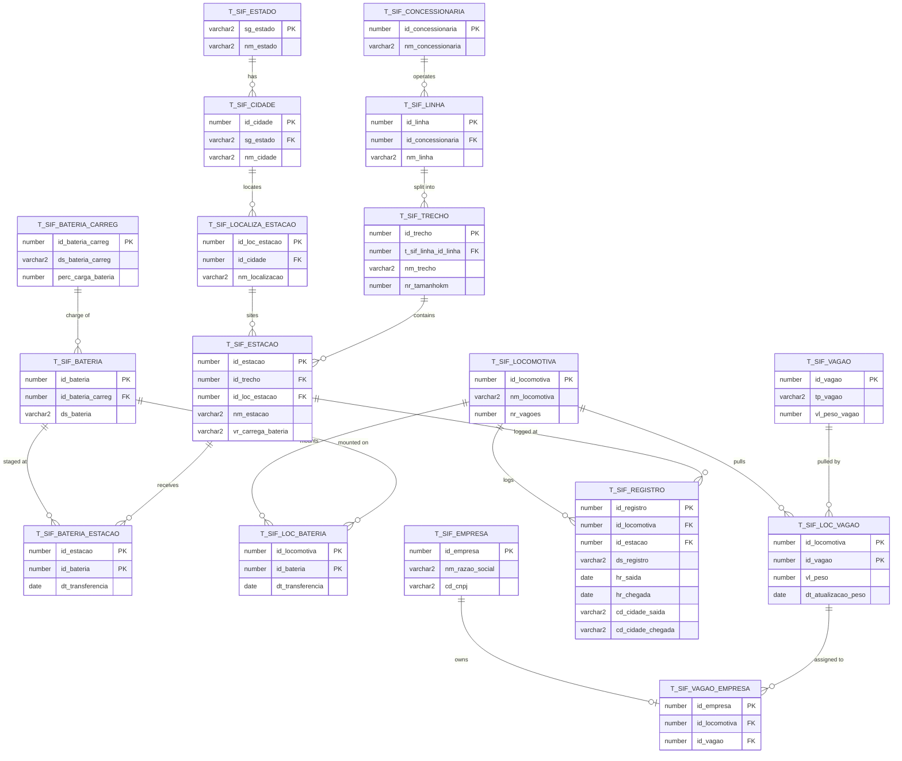
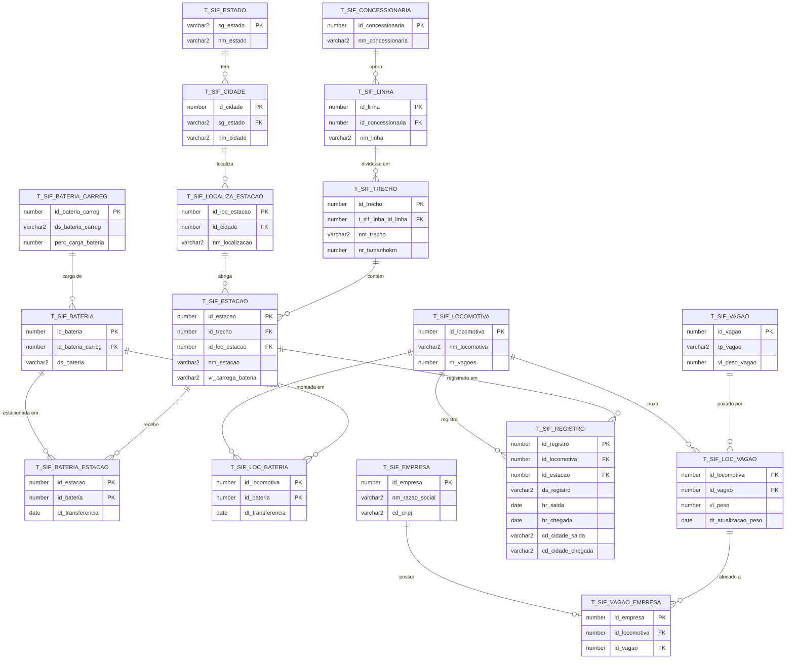
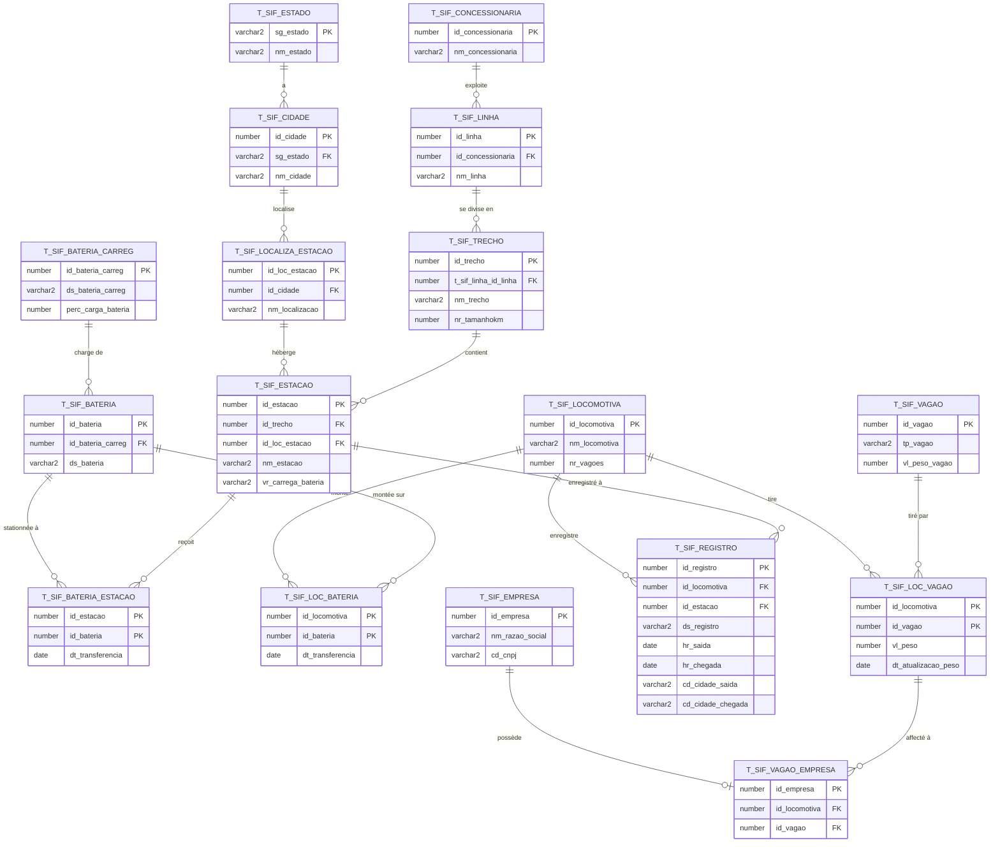

# FeVias: Winner of the Stellantis Challenge (FIAP)

> **FeVias (FerroVias)** won the **Stellantis smart-mobility challenge** run at **FIAP**.
> It is an Oracle database that models a **battery-swap station network for a
> railway mesh**: locomotives run on rechargeable batteries and swap them at
> stations spread along the Brazilian rail grid, instead of burning diesel.

[](https://www.fiap.com.br/)
[](https://opensource.org/licenses/MIT)
[](https://www.oracle.com/database/free/)

**Language / Idioma / Langue / 语言:**
[English](#english) · [Português](#portugues) · [Français](#francais) · [简体中文](#chinese)

> The analytical results (**[Worked queries](#findings)**) are kept in English
> only. The Portuguese, French and Chinese sections link to them.

---

<a id="english"></a>
<details open>
<summary><b>English</b></summary>

### Overview

The Stellantis group challenged FIAP students: **"How can technology and
innovation contribute to mobility, increasing efficiency, reducing accidents,
widening access for populations, and fostering a real smart society and smart
mobility?"**

**FeVias** answers with a database for a railway that runs on **clean energy and
rechargeable batteries**. Locomotives no longer depend on a fuel supply chain:
they carry battery packs and **swap them for charged ones at stations** along
each route. The schema captures the whole picture: the rail network
(concessionaires → lines → segments → stations), the rolling stock (locomotives,
wagons, batteries), and the operational events that tie them together
(trips, battery transfers, wagon assignments).

### Solution video

Click the image to watch the project walkthrough:

[](https://www.youtube.com/watch?v=n5WVaHOHnvI)

### Data model (ERD)

The diagram below is generated directly from `DDL_FeVias.sql`: 17 tables, with
primary keys, foreign keys and cardinalities exactly as the constraints declare
them. `||--o{` reads "one to zero-or-many"; `||--o|` reads "one to zero-or-one".



### Project Development in Oracle SQL

The original diagram from when the database was first built in Oracle SQL, kept
here as the authentic record of the project's original design work, predating the
current AI era:


### Data dictionary

| Table | Purpose | Key columns |
|---|---|---|
| `t_sif_estado` | Brazilian states (lookup) | `sg_estado` **PK** |
| `t_sif_cidade` | Cities, each in a state | `id_cidade` **PK**, `sg_estado` FK |
| `t_sif_localiza_estacao` | Physical station location / address | `id_loc_estacao` **PK**, `id_cidade` FK |
| `t_sif_estacao` | Stations; `vr_carrega_bateria` = can it charge (`S`/`N`) | `id_estacao` **PK**, `id_trecho` FK, `id_loc_estacao` FK |
| `t_sif_concessionaria` | Rail concessionaires | `id_concessionaria` **PK** |
| `t_sif_linha` | Lines operated by a concessionaire | `id_linha` **PK**, `id_concessionaria` FK |
| `t_sif_trecho` | Route segments of a line, with length in km | `id_trecho` **PK**, `t_sif_linha_id_linha` FK |
| `t_sif_locomotiva` | Locomotives; `nr_vagoes` = wagon count | `id_locomotiva` **PK** |
| `t_sif_vagao` | Wagons; type `P`/`O`, weight | `id_vagao` **PK** |
| `t_sif_loc_vagao` | Which wagons a locomotive pulls (plus weight, timestamp) | `(id_locomotiva, id_vagao)` **PK** |
| `t_sif_empresa` | Operating companies (CNPJ) | `id_empresa` **PK** |
| `t_sif_vagao_empresa` | Company to (locomotive, wagon) ownership | `id_empresa` **PK** plus FK to `loc_vagao` |
| `t_sif_bateria_carreg` | Battery charge record; `perc_carga_bateria` % | `id_bateria_carreg` **PK** |
| `t_sif_bateria` | Batteries | `id_bateria` **PK**, `id_bateria_carreg` FK |
| `t_sif_bateria_estacao` | Battery to station transfers (plus timestamp) | `(id_estacao, id_bateria)` **PK** |
| `t_sif_loc_bateria` | Battery to locomotive mounts (plus timestamp) | `(id_locomotiva, id_bateria)` **PK** |
| `t_sif_registro` | Trip log: departure/arrival times and cities | `id_registro` **PK**, `id_locomotiva` FK, `id_estacao` FK |

<a id="findings"></a>
### Worked queries: what the model answers

This is a **proof of concept**: "what a Brazilian railway database would look
like once a battery-swap system is deployed on it." The base reference data lives
in `DML_FeVias.sql` (the original seed, left untouched). On top of it,
`DML_FeVias_operacao.sql` adds a **synthetic ~1-week operating scenario** that
populates the five event tables that were empty and fixes two data bugs, so the
five queries in [`queries/`](queries) return **real, reproducible numbers**.

> **Read this honestly:** the operating data is **synthetic and illustrative**.
> These results show *what the model can answer* once it carries operational data,
> not a claim about real railway operations. Numbers are computed from the
> deterministic seed and reproduce with `make seed && make query` (see
> [Running it](#running-it)); every table/column was verified against the DDL.

#### 1. Locomotives running a low battery

Query [`01_locomotive_battery_readiness.sql`](queries/01_locomotive_battery_readiness.sql):
for each locomotive, the currently-mounted pack (most recent mount) and whether it
is below the 50% swap-ready line.

| id_locomotiva | nm_locomotiva | id_bateria | perc_carga_bateria | status |
|--:|---|--:|--:|---|
| 3 | Estrada de Ferro Carajás | 6 | 47 | BELOW THRESHOLD |
| 4 | Ferrovia Transnordestina Logística (FTL) | 7 | 52 | READY |
| 1 | Ferrovia Transnordestina Logística | 4 | 75 | READY |
| 2 | Locomotiva Malha Norte | 5 | 92 | READY |

**Reading:** **1 of 4** locomotives (Carajás, 47%) is running below the swap-ready
line, so that is the one to route to a charging station next. Because mounts are
timestamped, this is the *current* state (most-recent mount per locomotive), not a
static catalogue snapshot.

#### 2. Busy swap hubs

Query [`02_swap_station_throughput.sql`](queries/02_swap_station_throughput.sql):
how many battery transfers each station handled, and over what window.

| id_estacao | nm_estacao | qt_transferencias | primeira | ultima |
|--:|---|--:|---|---|
| 1 | Porto de Itaquí | 3 | 2024-06-01 | 2024-06-05 |
| 14 | Porto de Pecém | 1 | 2024-06-01 | 2024-06-01 |
| 15 | Porto de Pecém | 1 | 2024-06-04 | 2024-06-04 |
| 16 | Porto de Mucuípe | 1 | 2024-06-05 | 2024-06-05 |

**Reading:** Porto de Itaquí is the clear hub, with **3 of 6** transfers spread
across the week, while the Ceará ports saw single events. On real data this is
exactly the signal for where to add charging bays first; here it reflects the
synthetic seed, so read it as a demonstration of the ranking, not a capacity claim.

#### 3. Charging coverage and range risk per corridor

Query [`03_charging_coverage_by_trecho.sql`](queries/03_charging_coverage_by_trecho.sql):
distance between charging stations on each segment versus a nominal 300 km range
(only `S` stations count toward coverage).

| id_trecho | nm_trecho | nr_tamanhokm | qt_estacoes | qt_carregadoras | km_por_carregadora | avaliacao |
|--:|---|--:|--:|--:|--:|---|
| 5 | Itaqui a Mucuripe | 1000 | 0 | 0 | n/a | NO COVERAGE |
| 4 | Carajás a São Luís | 892 | 3 | 2 | 446.0 | RANGE RISK |
| 3 | Rondonópolis a Santa Fé do Sul | 696 | 4 | 2 | 348.0 | RANGE RISK |
| 2 | Itaqui a Mucuripe | 1000 | 4 | 4 | 250.0 | OK |
| 1 | Itaqui a Pecém | 1000 | 5 | 5 | 200.0 | OK |

**Reading:** real signal now. Trecho 5 has **no swap point at all**; trechos 4
(446 km/charger) and 3 (348) **exceed the 300 km nominal range**, so a battery
locomotive could strand between stations. Trechos 1 and 2 are fine. The gap is
driven by the `N` (not-yet-electrified) stations on 3 and 4, which is the query
doing exactly its coverage-gap job. Caveat: km-per-charger assumes even spacing;
the schema stores no station coordinates, so a real worst-case gap could be larger still.

#### 4. Trip activity and in-progress runs

Query [`04_trip_activity.sql`](queries/04_trip_activity.sql):
trips per locomotive, how many are still running, and average completed duration.

| id_locomotiva | nm_locomotiva | total_viagens | em_andamento | horas_medias_concluidas |
|--:|---|--:|--:|--:|
| 1 | Ferrovia Transnordestina Logística | 3 | 1 | 4.3 |
| 2 | Locomotiva Malha Norte | 2 | 0 | 7.3 |
| 3 | Estrada de Ferro Carajás | 2 | 1 | 7 |
| 4 | Ferrovia Transnordestina Logística (FTL) | 1 | 0 | 2 |

**Reading:** **8 trips** logged across the week, **2 still in progress**
(Transnordestina and Carajás each have one running). Completed runs average
2 to 7.3 h, with Malha Norte's the longest. Null arrivals are treated as a
first-class "in progress" state, not missing data.

#### 5. Assigned payload versus declared capacity

Query [`05_assigned_vs_declared_payload.sql`](queries/05_assigned_vs_declared_payload.sql):
actual assigned wagons and payload per locomotive versus the wagon count stored on
the locomotive record.

| id_locomotiva | nm_locomotiva | nr_vagoes_declarado | vagoes_atribuidos | peso_total_atribuido |
|--:|---|--:|--:|--:|
| 2 | Locomotiva Malha Norte | 56 | 5 | 1800 |
| 3 | Estrada de Ferro Carajás | 33 | 3 | 1800 |
| 4 | Ferrovia Transnordestina Logística (FTL) | 13 | 1 | 700 |
| 1 | Ferrovia Transnordestina Logística | 13 | 3 | 450 |

**Reading:** assigned wagons (1 to 5) sit far below the declared `nr_vagoes`
(13 to 56). That gap is the point: `nr_vagoes` is a stored, hand-entered figure
while `vagoes_atribuidos` is counted from real assignments, and the two drift,
which is exactly the risk of the denormalized count flagged in
[Design decisions](#design-decisions). Total assigned payload is **4,750 t** (the
whole wagon pool).

### Design decisions

**Why this normalization.** Geography is a clean 3NF lookup chain
(`estado → cidade → localiza_estacao → estacao`), and the network hierarchy
mirrors it: `concessionaria → linha → trecho → estacao`. Battery *identity*
(`t_sif_bateria`) is separated from *charge state* (`t_sif_bateria_carreg`) so a
pack's reading can change without rewriting its identity row. Many-to-many
operational relationships are resolved through junction tables
(`bateria_estacao`, `loc_bateria`, `loc_vagao`, `vagao_empresa`), each carrying
its own event attributes (`dt_transferencia`, `vl_peso`, and so on).

**What was denormalized on purpose.**
- `t_sif_registro.cd_cidade_saida` / `cd_cidade_chegada` keep origin/destination
  city as plain text next to the `id_estacao` FK. A trip log is write-heavy and
  read on the hot path; storing the city inline avoids the
  `estacao → localiza_estacao → cidade` join on every read. Trade-off: it can
  drift from the `cidade` table.
- `t_sif_localiza_estacao.nm_localizacao` is free-text that restates city/state
  already reachable via `id_cidade`, kept for human-readable station addressing.
- `t_sif_locomotiva.nr_vagoes` is a stored wagon count also derivable from
  `t_sif_loc_vagao`, a maintained aggregate for quick display.

**As-built quirks worth flagging** (the **schema** is unchanged; data fixes are
layered in `DML_FeVias_operacao.sql`, never editing the original seed):
- `t_sif_vagao_empresa`'s primary key is `id_empresa` **alone**, so a company can
  appear only once and cannot own more than one `(locomotive, wagon)` pair, so the
  operational seed can hold just two rows here. With real data this should be a
  composite key `(id_empresa, id_locomotiva, id_vagao)`.
- `t_sif_bateria` and `t_sif_bateria_carreg` are effectively **1:1**; the separate
  table only earns its keep once charge cycles are historized over time.
- Data-quality bugs the queries surfaced, now **corrected in the operational
  layer** (via `UPDATE`, leaving `DML_FeVias.sql` intact). The "Malha Paulista"
  line took its `id_concessionaria` from the *line* sequence (a `currval` slip),
  now repointed to Rumo S/A. And every station was flagged chargeable, so three
  inland stations were set to `N` to model a phased rollout, which is what makes
  query 3's coverage analysis meaningful. The duplicate "Rumo S/A" concessionaire
  row is left in place and flagged, not silently deleted.

**What I'd change with real data.** The event tables now carry an **illustrative
synthetic scenario**; a real deployment would stream **true telemetry** instead of
a hand-built week. Beyond that: historize charge readings with timestamps (turn
the readiness view into a trend); add coordinates or an ordinal position to
stations so inter-swap distance is exact instead of an average; promote
`vagao_empresa` to a composite key so a company can own more than one wagon; and
reconcile `nr_vagoes` with actual assignments (query 5 shows the two already
drift).

<a id="running-it"></a>
### Running it

No account or license is needed; the setup uses Oracle Database Free in a
container. Requirements: Docker (with Compose) and `make`.

```bash
make seed     # start Oracle; load DDL, base data, then the operational layer
make query    # run every file in queries/ and print the results
make psql     # open an interactive SQL*Plus session
make down     # stop the container (keeps data)
make clean    # stop and delete the volume
```

`make seed` loads three files in order: `DDL_FeVias.sql`, then `DML_FeVias.sql`,
then `DML_FeVias_operacao.sql`. The base DML is ISO-8859-1 (Latin-1); the Makefile
sets `NLS_LANG` so the client reads it in the right charset. **The SQL files are
mounted read-only, so the container never edits them; the original `DML_FeVias.sql`
is never modified.**

Prefer a database you already have? Run `DDL_FeVias.sql`, `DML_FeVias.sql`,
`DML_FeVias_operacao.sql`, then any file in `queries/` in an Oracle SQL client.

### Project files

- **`DDL_FeVias.sql`**: the schema (tables, constraints, comments, sequences).
- **`DDL_Drop.sql`**: drops the whole schema for a clean rebuild.
- **`DML_FeVias.sql`**: original base seed (real Brazilian lines and swap network),
  left untouched.
- **`DML_FeVias_operacao.sql`**: operational layer, with data-bug fixes and a
  synthetic ~1-week scenario populating the five event tables.
- **`queries/`**: five analytical queries, one operational question each.
- **`docker-compose.yml`, `Makefile`**: minimal, reproducible run environment.

### License and contact

MIT. See [LICENSE](LICENSE). Questions:
[anacarolina.cartola@gmail.com](mailto:anacarolina.cartola@gmail.com).

</details>

---

<a id="portugues"></a>
<details>
<summary><b>Português</b></summary>

### Visão geral

O grupo Stellantis desafiou os alunos da FIAP: **"Como a tecnologia e a inovação
podem contribuir para a mobilidade, aumentando a eficiência, reduzindo
acidentes, ampliando o acesso das populações e criando uma verdadeira smart
society e smart mobility?"**

**FeVias** responde com um banco de dados para uma ferrovia movida a **energia
limpa e baterias recarregáveis**. As locomotivas deixam de depender de uma cadeia
de combustível: carregam pacotes de bateria e **os trocam por outros carregados
nas estações** ao longo de cada rota. O schema captura o quadro completo: a malha
ferroviária (concessionárias → linhas → trechos → estações), o material rodante
(locomotivas, vagões, baterias) e os eventos operacionais que os conectam
(viagens, transferências de bateria, alocação de vagões).

### Vídeo da solução

Clique na imagem para assistir à apresentação do projeto:

[](https://www.youtube.com/watch?v=n5WVaHOHnvI)

### Modelo de dados (DER)

O diagrama abaixo é gerado diretamente de `DDL_FeVias.sql`: 17 tabelas, com
chaves primárias, estrangeiras e cardinalidades exatamente como as constraints
declaram. `||--o{` lê-se "um para zero-ou-muitos"; `||--o|` lê-se "um para
zero-ou-um".



### Desenvolvimento do projeto em Oracle SQL

O diagrama original de quando o banco foi construído em Oracle SQL, mantido aqui
como registro autêntico do trabalho de modelagem original do projeto, anterior à
era atual da IA:


### Dicionário de dados

| Tabela | Finalidade | Colunas-chave |
|---|---|---|
| `t_sif_estado` | Estados brasileiros (lookup) | `sg_estado` **PK** |
| `t_sif_cidade` | Cidades, cada uma em um estado | `id_cidade` **PK**, `sg_estado` FK |
| `t_sif_localiza_estacao` | Localização/endereço físico da estação | `id_loc_estacao` **PK**, `id_cidade` FK |
| `t_sif_estacao` | Estações; `vr_carrega_bateria` = carrega? (`S`/`N`) | `id_estacao` **PK**, `id_trecho` FK, `id_loc_estacao` FK |
| `t_sif_concessionaria` | Concessionárias ferroviárias | `id_concessionaria` **PK** |
| `t_sif_linha` | Linhas operadas por uma concessionária | `id_linha` **PK**, `id_concessionaria` FK |
| `t_sif_trecho` | Trechos de uma linha, com extensão em km | `id_trecho` **PK**, `t_sif_linha_id_linha` FK |
| `t_sif_locomotiva` | Locomotivas; `nr_vagoes` = qtd. de vagões | `id_locomotiva` **PK** |
| `t_sif_vagao` | Vagões; tipo `P`/`O`, peso | `id_vagao` **PK** |
| `t_sif_loc_vagao` | Quais vagões uma locomotiva puxa (mais peso, data) | `(id_locomotiva, id_vagao)` **PK** |
| `t_sif_empresa` | Empresas operadoras (CNPJ) | `id_empresa` **PK** |
| `t_sif_vagao_empresa` | Empresa para (locomotiva, vagão) | `id_empresa` **PK** mais FK para `loc_vagao` |
| `t_sif_bateria_carreg` | Registro de carga; `perc_carga_bateria` % | `id_bateria_carreg` **PK** |
| `t_sif_bateria` | Baterias | `id_bateria` **PK**, `id_bateria_carreg` FK |
| `t_sif_bateria_estacao` | Transferências bateria para estação (mais data) | `(id_estacao, id_bateria)` **PK** |
| `t_sif_loc_bateria` | Montagens bateria para locomotiva (mais data) | `(id_locomotiva, id_bateria)` **PK** |
| `t_sif_registro` | Registro de viagens: horários e cidades | `id_registro` **PK**, `id_locomotiva` FK, `id_estacao` FK |

### Resultados analíticos

A seção de resultados (**Findings**) é mantida apenas em inglês. **[Ver os
resultados analíticos](#findings)**

Em resumo: são cinco consultas em [`queries/`](queries), uma pergunta operacional
cada. Como esta é uma **POC**, o seed base (`DML_FeVias.sql`) traz os dados de
referência e uma camada operacional (`DML_FeVias_operacao.sql`) adiciona um
**cenário sintético de ~1 semana** que popula as cinco tabelas de evento antes
vazias e corrige dois bugs de dados, então as queries devolvem números reais e
reproduzíveis. Os dados operacionais são **sintéticos e ilustrativos**: mostram *o
que o modelo consegue responder* quando carrega dados de operação, não uma
afirmação sobre a operação ferroviária real.

### Decisões de projeto

**Por que essa normalização.** A geografia é uma cadeia de lookup em 3FN
(`estado → cidade → localiza_estacao → estacao`), e a hierarquia da malha a
espelha: `concessionaria → linha → trecho → estacao`. A *identidade* da bateria
(`t_sif_bateria`) é separada do *estado de carga* (`t_sif_bateria_carreg`) para
que a leitura mude sem reescrever a linha de identidade. Relações muitos-para-
muitos são resolvidas por tabelas de junção (`bateria_estacao`, `loc_bateria`,
`loc_vagao`, `vagao_empresa`), cada uma com seus atributos de evento
(`dt_transferencia`, `vl_peso`, etc.).

**O que foi desnormalizado de propósito.**
- `t_sif_registro.cd_cidade_saida` / `cd_cidade_chegada` guardam a cidade de
  origem/destino como texto ao lado da FK `id_estacao`. Um log de viagem é
  intensivo em escrita e lido no caminho quente; guardar a cidade inline evita o
  join `estacao → localiza_estacao → cidade` a cada leitura. Custo: pode divergir
  da tabela `cidade`.
- `t_sif_localiza_estacao.nm_localizacao` é texto livre que repete cidade/estado
  já acessíveis via `id_cidade`, mantido para endereçamento legível da estação.
- `t_sif_locomotiva.nr_vagoes` é uma contagem de vagões também derivável de
  `t_sif_loc_vagao`, um agregado mantido para exibição rápida.

**Peculiaridades do modelo** (o **schema** não é alterado; as correções de dados
ficam em `DML_FeVias_operacao.sql`, sem editar o seed original):
- A chave primária de `t_sif_vagao_empresa` é **só** `id_empresa`, então uma
  empresa aparece uma única vez e não pode possuir mais de um par
  `(locomotiva, vagão)`, então o seed operacional só cabe duas linhas aqui.
  Com dados reais, deveria ser chave composta `(id_empresa, id_locomotiva, id_vagao)`.
- `t_sif_bateria` e `t_sif_bateria_carreg` são, na prática, **1:1**; a tabela
  separada só se justifica ao historiar ciclos de carga no tempo.
- Bugs de dados que as queries acharam, agora **corrigidos na camada operacional**
  (via `UPDATE`, deixando `DML_FeVias.sql` intacto). A linha "Malha Paulista"
  pegava o `id_concessionaria` da sequência de *linha* (deslize de `currval`),
  agora reapontada para a Rumo S/A. E toda estação era carregável, então três
  estações do interior foram marcadas como `N` para simular um rollout por fases,
  o que dá sentido à análise de cobertura da query 3. A linha duplicada da
  concessionária "Rumo S/A" fica onde está e é sinalizada, não apagada silenciosamente.

**O que eu mudaria com dados reais.** As tabelas de evento hoje carregam um
**cenário sintético ilustrativo**; um deploy real transmitiria **telemetria de
verdade** em vez de uma semana montada à mão. Além disso: historiar as leituras de
carga com timestamp (transformar a visão em tendência); adicionar coordenadas ou
posição ordinal às estações para que a distância entre trocas seja exata em vez de
média; promover `vagao_empresa` a chave composta; e reconciliar `nr_vagoes` com as
atribuições reais (a query 5 mostra que já divergem).

### Como executar

Não precisa de conta nem licença; o setup usa o Oracle Database Free em
container. Requisitos: Docker (com Compose) e `make`.

```bash
make seed     # sobe o Oracle; carrega DDL, dados base e a camada operacional
make query    # roda cada arquivo de queries/ e imprime os resultados
make psql     # abre uma sessão interativa do SQL*Plus
make down     # para o container (mantém os dados)
make clean    # para e apaga o volume
```

O `make seed` carrega três arquivos em ordem: `DDL_FeVias.sql`, depois
`DML_FeVias.sql`, depois `DML_FeVias_operacao.sql`. O DML base é ISO-8859-1
(Latin-1); o Makefile define `NLS_LANG` para o cliente ler no charset correto.
**Os arquivos SQL são montados como somente-leitura, então o container nunca os
edita; o `DML_FeVias.sql` original jamais é modificado.**

Prefere um banco que já tem? Execute `DDL_FeVias.sql`, `DML_FeVias.sql`,
`DML_FeVias_operacao.sql` e então qualquer arquivo de `queries/` em um cliente Oracle.

### Arquivos do projeto

- **`DDL_FeVias.sql`**: o schema (tabelas, constraints, comentários, sequences).
- **`DDL_Drop.sql`**: apaga todo o schema para reconstrução limpa.
- **`DML_FeVias.sql`**: seed base original (linhas brasileiras reais e rede de
  troca), mantido intacto.
- **`DML_FeVias_operacao.sql`**: camada operacional, com correções de dados e um
  cenário sintético de ~1 semana populando as cinco tabelas de evento.
- **`queries/`**: cinco consultas analíticas, uma pergunta operacional cada.
- **`docker-compose.yml`, `Makefile`**: ambiente de execução mínimo e reprodutível.

### Licença e contato

MIT. Veja [LICENSE](LICENSE). Dúvidas:
[anacarolina.cartola@gmail.com](mailto:anacarolina.cartola@gmail.com).

</details>

---

<a id="francais"></a>
<details>
<summary><b>Français</b></summary>

### Aperçu

Le groupe Stellantis a lancé un défi aux étudiants de la FIAP : **« Comment la
technologie et l'innovation peuvent-elles contribuer à la mobilité : accroître
l'efficacité, réduire les accidents, élargir l'accès des populations et favoriser
une véritable smart society et smart mobility ? »**

**FeVias** y répond avec une base de données pour un chemin de fer fonctionnant à
l'**énergie propre et aux batteries rechargeables**. Les locomotives ne dépendent
plus d'une chaîne d'approvisionnement en carburant : elles transportent des
batteries et **les échangent contre des batteries chargées dans les stations** le
long de chaque itinéraire. Le schéma capture l'ensemble : le réseau ferroviaire
(concessionnaires → lignes → tronçons → stations), le matériel roulant
(locomotives, wagons, batteries) et les événements opérationnels qui les relient
(trajets, transferts de batteries, affectation des wagons).

### Vidéo de la solution

Cliquez sur l'image pour voir la présentation du projet :

[](https://www.youtube.com/watch?v=n5WVaHOHnvI)

### Modèle de données (MCD)

Le diagramme ci-dessous est généré directement depuis `DDL_FeVias.sql` : 17
tables, avec clés primaires, clés étrangères et cardinalités exactement telles que
les contraintes les déclarent. `||--o{` se lit « un vers zéro-ou-plusieurs » ;
`||--o|` se lit « un vers zéro-ou-un ».



### Développement du projet en Oracle SQL

Le diagramme original de la première conception de la base en Oracle SQL,
conservé ici comme trace authentique du travail de modélisation d'origine du
projet, antérieur à l'ère actuelle de l'IA :


### Dictionnaire de données

| Table | Rôle | Colonnes-clés |
|---|---|---|
| `t_sif_estado` | États brésiliens (référentiel) | `sg_estado` **PK** |
| `t_sif_cidade` | Villes, chacune dans un état | `id_cidade` **PK**, `sg_estado` FK |
| `t_sif_localiza_estacao` | Emplacement/adresse physique de la station | `id_loc_estacao` **PK**, `id_cidade` FK |
| `t_sif_estacao` | Stations ; `vr_carrega_bateria` = recharge ? (`S`/`N`) | `id_estacao` **PK**, `id_trecho` FK, `id_loc_estacao` FK |
| `t_sif_concessionaria` | Concessionnaires ferroviaires | `id_concessionaria` **PK** |
| `t_sif_linha` | Lignes exploitées par un concessionnaire | `id_linha` **PK**, `id_concessionaria` FK |
| `t_sif_trecho` | Tronçons d'une ligne, longueur en km | `id_trecho` **PK**, `t_sif_linha_id_linha` FK |
| `t_sif_locomotiva` | Locomotives ; `nr_vagoes` = nb de wagons | `id_locomotiva` **PK** |
| `t_sif_vagao` | Wagons ; type `P`/`O`, poids | `id_vagao` **PK** |
| `t_sif_loc_vagao` | Wagons tirés par une locomotive (plus poids, date) | `(id_locomotiva, id_vagao)` **PK** |
| `t_sif_empresa` | Entreprises exploitantes (CNPJ) | `id_empresa` **PK** |
| `t_sif_vagao_empresa` | Entreprise vers (locomotive, wagon) | `id_empresa` **PK** plus FK vers `loc_vagao` |
| `t_sif_bateria_carreg` | Relevé de charge ; `perc_carga_bateria` % | `id_bateria_carreg` **PK** |
| `t_sif_bateria` | Batteries | `id_bateria` **PK**, `id_bateria_carreg` FK |
| `t_sif_bateria_estacao` | Transferts batterie vers station (plus date) | `(id_estacao, id_bateria)` **PK** |
| `t_sif_loc_bateria` | Montages batterie vers locomotive (plus date) | `(id_locomotiva, id_bateria)` **PK** |
| `t_sif_registro` | Journal des trajets : horaires et villes | `id_registro` **PK**, `id_locomotiva` FK, `id_estacao` FK |

### Résultats analytiques

La section des résultats (**Findings**) est maintenue en anglais uniquement.
**[Voir les résultats analytiques](#findings)**

En bref : cinq requêtes dans [`queries/`](queries), une question opérationnelle
chacune. Comme il s'agit d'une **POC**, le seed de base (`DML_FeVias.sql`) fournit
les données de référence et une couche opérationnelle (`DML_FeVias_operacao.sql`)
ajoute un **scénario synthétique d'~1 semaine** qui remplit les cinq tables
d'événements auparavant vides et corrige deux bugs de données, si bien que les
requêtes renvoient des chiffres réels et reproductibles. Les données opérationnelles
sont **synthétiques et illustratives** : elles montrent *ce que le modèle sait
répondre* une fois qu'il porte des données d'exploitation, pas une affirmation sur
l'exploitation ferroviaire réelle.

### Choix de conception

**Pourquoi cette normalisation.** La géographie est une chaîne de référentiels en
3FN (`estado → cidade → localiza_estacao → estacao`), et la hiérarchie du réseau
la reflète : `concessionaria → linha → trecho → estacao`. L'*identité* de la
batterie (`t_sif_bateria`) est séparée de son *état de charge*
(`t_sif_bateria_carreg`) afin que le relevé change sans réécrire la ligne
d'identité. Les relations plusieurs-à-plusieurs passent par des tables de jonction
(`bateria_estacao`, `loc_bateria`, `loc_vagao`, `vagao_empresa`), chacune portant
ses attributs d'événement (`dt_transferencia`, `vl_peso`, etc.).

**Ce qui a été dénormalisé volontairement.**
- `t_sif_registro.cd_cidade_saida` / `cd_cidade_chegada` conservent la ville de
  départ/arrivée en texte à côté de la FK `id_estacao`. Un journal de trajets est
  intensif en écriture et lu sur le chemin critique ; stocker la ville en ligne
  évite la jointure `estacao → localiza_estacao → cidade` à chaque lecture.
  Contrepartie : risque de divergence avec la table `cidade`.
- `t_sif_localiza_estacao.nm_localizacao` est un texte libre qui répète
  ville/état déjà accessibles via `id_cidade`, conservé pour un adressage lisible.
- `t_sif_locomotiva.nr_vagoes` est un nombre de wagons également dérivable de
  `t_sif_loc_vagao`, un agrégat maintenu pour l'affichage rapide.

**Particularités du modèle** (le **schéma** n'est pas modifié ; les correctifs de
données sont dans `DML_FeVias_operacao.sql`, sans éditer le seed d'origine) :
- La clé primaire de `t_sif_vagao_empresa` est **uniquement** `id_empresa` ; une
  entreprise n'apparaît donc qu'une fois et ne peut posséder plus d'un couple
  `(locomotive, wagon)`, si bien que le seed opérationnel n'y tient que deux lignes.
  Avec des données réelles, il faudrait une clé composite `(id_empresa, id_locomotiva, id_vagao)`.
- `t_sif_bateria` et `t_sif_bateria_carreg` sont en pratique **1:1** ; la table
  séparée ne se justifie qu'en historisant les cycles de charge dans le temps.
- Bugs de données révélés par les requêtes, désormais **corrigés dans la couche
  opérationnelle** (par `UPDATE`, en laissant `DML_FeVias.sql` intact). La ligne
  « Malha Paulista » prenait son `id_concessionaria` dans la séquence de *ligne*
  (écart de `currval`), désormais repointée vers Rumo S/A. Et chaque station était
  rechargeable, donc trois stations de l'intérieur ont été passées à `N` pour
  simuler un déploiement par phases, ce qui donne son sens à l'analyse de couverture
  de la requête 3. La ligne dupliquée du concessionnaire « Rumo S/A » reste en place
  et est signalée, non supprimée en silence.

**Ce que je changerais avec des données réelles.** Les tables d'événements portent
aujourd'hui un **scénario synthétique illustratif** ; un déploiement réel diffuserait
de la **vraie télémétrie** au lieu d'une semaine construite à la main. Au-delà :
historiser les relevés de charge avec horodatage (transformer la vue en tendance) ;
ajouter des coordonnées ou une position ordinale aux stations pour que la distance
entre échanges soit exacte plutôt que moyenne ; promouvoir `vagao_empresa` en clé
composite ; et réconcilier `nr_vagoes` avec les affectations réelles (la requête 5
montre qu'elles divergent déjà).

### Exécution

Aucun compte ni licence requis ; l'installation utilise Oracle Database Free en
conteneur. Prérequis : Docker (avec Compose) et `make`.

```bash
make seed     # démarre Oracle ; charge le DDL, les données de base et la couche opérationnelle
make query    # exécute chaque fichier de queries/ et affiche les résultats
make psql     # ouvre une session SQL*Plus interactive
make down     # arrête le conteneur (conserve les données)
make clean    # arrête et supprime le volume
```

`make seed` charge trois fichiers dans l'ordre : `DDL_FeVias.sql`, puis
`DML_FeVias.sql`, puis `DML_FeVias_operacao.sql`. Le DML de base est en ISO-8859-1
(Latin-1) ; le Makefile définit `NLS_LANG` pour le bon jeu de caractères. **Les
fichiers SQL sont montés en lecture seule, donc le conteneur ne les édite jamais ;
le `DML_FeVias.sql` d'origine n'est jamais modifié.**

Vous préférez une base existante ? Exécutez `DDL_FeVias.sql`, `DML_FeVias.sql`,
`DML_FeVias_operacao.sql`, puis n'importe quel fichier de `queries/` dans un client Oracle.

### Fichiers du projet

- **`DDL_FeVias.sql`** : le schéma (tables, contraintes, commentaires, séquences).
- **`DDL_Drop.sql`** : supprime tout le schéma pour une reconstruction propre.
- **`DML_FeVias.sql`** : seed de base d'origine (lignes brésiliennes réelles et
  réseau d'échange), laissé intact.
- **`DML_FeVias_operacao.sql`** : couche opérationnelle, avec correctifs de données
  et un scénario synthétique d'~1 semaine remplissant les cinq tables d'événements.
- **`queries/`** : cinq requêtes analytiques, une question opérationnelle chacune.
- **`docker-compose.yml`, `Makefile`** : environnement d'exécution minimal.

### Licence et contact

MIT. Voir [LICENSE](LICENSE). Questions :
[anacarolina.cartola@gmail.com](mailto:anacarolina.cartola@gmail.com).

</details>

---

<a id="chinese"></a>
<details>
<summary><b>简体中文</b></summary>

### 概述

Stellantis 集团向 FIAP 的学生发起挑战：**"技术与创新如何助力出行——提升效率、减少事故、
扩大民众可及性，并推动真正的智慧社会与智慧出行？"**

**FeVias** 的答案是一套面向**清洁能源与可充电电池**铁路的数据库。机车不再依赖燃料供应链：
它们携带电池组，并**在沿线车站换取已充电的电池**。该模式完整刻画了整体图景——铁路网络
（特许运营商 → 线路 → 区段 → 车站）、车辆装备（机车、车厢、电池），以及将它们连接起来的
运营事件（行程、电池转移、车厢分配）。

### 方案视频

点击图片观看项目演示：

[](https://www.youtube.com/watch?v=n5WVaHOHnvI)

### 数据模型（ERD）

下图直接由 `DDL_FeVias.sql` 生成——共 17 张表，主键、外键与基数完全依照约束声明。
`||--o{` 表示"一对零或多"；`||--o|` 表示"一对零或一"。


### 在 Oracle SQL 中的项目开发

数据库最初在 Oracle SQL 中构建时的原始图示——保留于此，作为项目最初建模工作的真实记录，
早于当前的 AI 时代：


### 数据字典

| 表 | 用途 | 关键列 |
|---|---|---|
| `t_sif_estado` | 巴西各州（查找表） | `sg_estado` **PK** |
| `t_sif_cidade` | 城市，各属一州 | `id_cidade` **PK**，`sg_estado` FK |
| `t_sif_localiza_estacao` | 车站的物理位置/地址 | `id_loc_estacao` **PK**，`id_cidade` FK |
| `t_sif_estacao` | 车站；`vr_carrega_bateria` = 能否充电（`S`/`N`） | `id_estacao` **PK**，`id_trecho` FK，`id_loc_estacao` FK |
| `t_sif_concessionaria` | 铁路特许运营商 | `id_concessionaria` **PK** |
| `t_sif_linha` | 由运营商运营的线路 | `id_linha` **PK**，`id_concessionaria` FK |
| `t_sif_trecho` | 线路的区段，含公里数 | `id_trecho` **PK**，`t_sif_linha_id_linha` FK |
| `t_sif_locomotiva` | 机车；`nr_vagoes` = 车厢数 | `id_locomotiva` **PK** |
| `t_sif_vagao` | 车厢；类型 `P`/`O`，重量 | `id_vagao` **PK** |
| `t_sif_loc_vagao` | 机车牵引哪些车厢（含重量、时间） | `(id_locomotiva, id_vagao)` **PK** |
| `t_sif_empresa` | 运营企业（CNPJ） | `id_empresa` **PK** |
| `t_sif_vagao_empresa` | 企业对应（机车、车厢） | `id_empresa` **PK** 及指向 `loc_vagao` 的 FK |
| `t_sif_bateria_carreg` | 充电记录；`perc_carga_bateria` % | `id_bateria_carreg` **PK** |
| `t_sif_bateria` | 电池 | `id_bateria` **PK**，`id_bateria_carreg` FK |
| `t_sif_bateria_estacao` | 电池对车站的转移（含时间） | `(id_estacao, id_bateria)` **PK** |
| `t_sif_loc_bateria` | 电池对机车的装载（含时间） | `(id_locomotiva, id_bateria)` **PK** |
| `t_sif_registro` | 行程日志：出发/到达时间与城市 | `id_registro` **PK**，`id_locomotiva` FK，`id_estacao` FK |

### 分析结果

结果（**Findings**）部分仅保留英文。**[查看分析结果](#findings)**

简而言之：[`queries/`](queries) 中有五条查询，每条对应一个运营问题。由于这是一个 **POC**，
基础种子（`DML_FeVias.sql`）提供参考数据，运营层（`DML_FeVias_operacao.sql`）再补上一个
**约一周的合成场景**，填充原先为空的五张事件表并修正两处数据缺陷——于是这些查询返回真实且
可复现的数字。运营数据是**合成的、仅作示意**：它展示*模型在承载运营数据后能回答什么*，而非
对真实铁路运营的论断。

### 设计决策

**为何这样归一化。** 地理信息是一条清晰的 3NF 查找链——
`estado → cidade → localiza_estacao → estacao`——网络层级与之对应：
`concessionaria → linha → trecho → estacao`。电池的*身份*（`t_sif_bateria`）与其*充电状态*
（`t_sif_bateria_carreg`）分离，使读数变化时无需改写身份行。多对多的运营关系通过连接表
（`bateria_estacao`、`loc_bateria`、`loc_vagao`、`vagao_empresa`）解决，每张表都携带各自的
事件属性（`dt_transferencia`、`vl_peso` 等）。

**哪些是有意反归一化的。**
- `t_sif_registro.cd_cidade_saida` / `cd_cidade_chegada` 在 `id_estacao` 外键旁以纯文本保存
  出发/到达城市。行程日志写入频繁且处于读取热路径；就地保存城市名可避免每次读取都做
  `estacao → localiza_estacao → cidade` 连接。代价：可能与 `cidade` 表产生偏差。
- `t_sif_localiza_estacao.nm_localizacao` 是自由文本，重复了已可经 `id_cidade` 获取的
  城市/州信息——保留用于人类可读的车站地址。
- `t_sif_locomotiva.nr_vagoes` 是同样可由 `t_sif_loc_vagao` 推导的车厢计数——为快速展示而
  维护的聚合值。

**值得指出的建模特点**（**模式**未改动；数据修正放在 `DML_FeVias_operacao.sql`，不编辑原始种子）：
- `t_sif_vagao_empresa` 的主键**仅**为 `id_empresa`，因此一家企业只能出现一次，无法拥有
  多个 `(机车, 车厢)` 组合——所以运营种子在此只能放两行。若用真实数据，应改为复合主键
  `(id_empresa, id_locomotiva, id_vagao)`。
- `t_sif_bateria` 与 `t_sif_bateria_carreg` 实质上是 **1:1**；只有当需要按时间记录充电周期
  时，独立成表才有意义。
- 查询暴露的数据缺陷，现已在**运营层修正**（通过 `UPDATE`，保持 `DML_FeVias.sql` 原封不动）：
  "Malha Paulista" 线路的 `id_concessionaria` 取自*线路*序列（`currval` 失误）——已改指向
  Rumo S/A；且每个车站都被标为可充电——已将三个内陆车站设为 `N`，模拟分阶段部署，这正是让
  查询 3 的覆盖分析有意义的原因。重复的 "Rumo S/A" 运营商行保留原样并加以标注，而非静默删除。

**若有真实数据我会怎么改。** 事件表现在承载一个**合成的示意场景**；真实部署会推送**真实遥测**
而非手工搭的一周数据。此外：为充电读数加上时间戳（把视图变成趋势）；为车站添加坐标或顺序
位置，使换电间距是精确值而非平均值；将 `vagao_empresa` 提升为复合主键；并让 `nr_vagoes` 与
真实分配对账（查询 5 已显示两者出现偏差）。

### 如何运行

无需账号或许可证——环境使用容器化的 Oracle Database Free。前置条件：Docker（含 Compose）
与 `make`。

```bash
make seed     # 启动 Oracle；加载 DDL、基础数据，再加载运营层
make query    # 运行 queries/ 中每个文件并打印结果
make psql     # 打开交互式 SQL*Plus 会话
make down     # 停止容器（保留数据）
make clean    # 停止并删除数据卷
```

`make seed` 按顺序加载三个文件：`DDL_FeVias.sql`、`DML_FeVias.sql`、
`DML_FeVias_operacao.sql`。基础 DML 为 ISO-8859-1（Latin-1）；Makefile 设置了 `NLS_LANG`
以正确字符集读取。**SQL 文件以只读方式挂载——容器绝不编辑它们；原始 `DML_FeVias.sql` 永不被修改。**

已有数据库？在 Oracle 客户端中依次执行 `DDL_FeVias.sql`、`DML_FeVias.sql`、
`DML_FeVias_operacao.sql`，再运行 `queries/` 中的任意文件即可。

### 项目文件

- **`DDL_FeVias.sql`**：模式（表、约束、注释、序列）。
- **`DDL_Drop.sql`**：删除整个模式以便干净重建。
- **`DML_FeVias.sql`**：原始基础种子（真实巴西线路与换电网络），保持原封不动。
- **`DML_FeVias_operacao.sql`**：运营层，包含数据修正与填充五张事件表的约一周合成场景。
- **`queries/`**：五条分析查询，每条对应一个运营问题。
- **`docker-compose.yml`、`Makefile`**：最小化、可复现的运行环境。

### 许可证与联系方式

MIT——见 [LICENSE](LICENSE)。如有疑问：
[anacarolina.cartola@gmail.com](mailto:anacarolina.cartola@gmail.com)。

</details>

---


